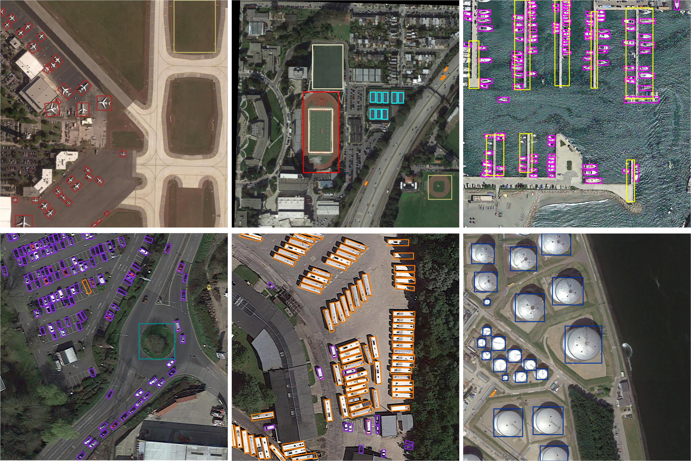

# VRDet: Precise Vertex Regression and Feature Decoupling for Oriented Object Detection

## Introduction

VRDet is the implementation of the oriented object detector for Precise Vertex Regression and Feature Decoupling for Oriented Object Detection,
which is based on [mmdetection](https://github.com/open-mmlab/mmdetection) and [BboxToolkit](https://github.com/jbwang1997/BboxToolkit).

## Detection visualization results


## Installation

Please refer to [install.md](docs/install.md) for installation.

## Getting Started

Please refer to [getting_started.md](docs/getting_started.md) for the basic usage.

## Citation
```
@article{mmdetection,
  title   = {{MMDetection}: Open MMLab Detection Toolbox and Benchmark},
  author  = {Chen, Kai and Wang, Jiaqi and Pang, Jiangmiao and Cao, Yuhang and
             Xiong, Yu and Li, Xiaoxiao and Sun, Shuyang and Feng, Wansen and
             Liu, Ziwei and Xu, Jiarui and Zhang, Zheng and Cheng, Dazhi and
             Zhu, Chenchen and Cheng, Tianheng and Zhao, Qijie and Li, Buyu and
             Lu, Xin and Zhu, Rui and Wu, Yue and Dai, Jifeng and Wang, Jingdong
             and Shi, Jianping and Ouyang, Wanli and Loy, Chen Change and Lin, Dahua},
  journal = {arXiv preprint arXiv:1906.07155},
  year={2019}
}
```
